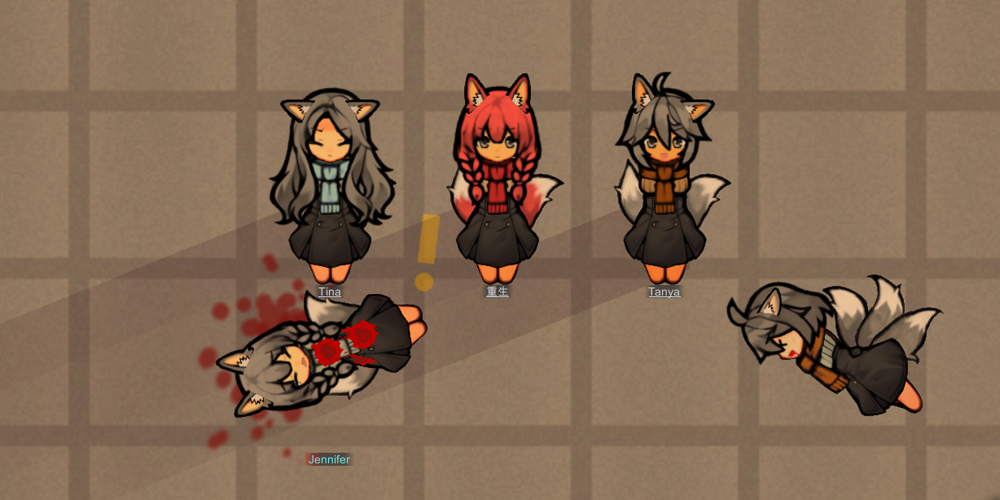
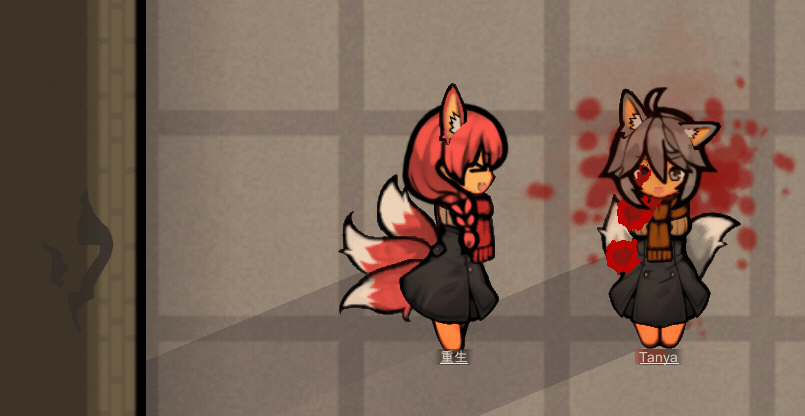

# FaceAddonFramework
Face Addon Framework —— Add any FaceAddon you want for any pawn who has a head!
Adding face addon which can make facial expression to any creatures. It also can be used as a lightweight version of the facial expression framework, inspired by Garam.

## 1.4 support
If you want to use this in 1.4, please read the [READMEv1-4.md](./1.4/READMEv1-4.md)

## Example Project
- Kurin Meow Edition (WIP)




## HowToUse
- Add a comp `FaceAddon.CompProperties_FaceAddonComps` to your Pawn's ThingDef
- You can also use `FaceAddon.CompProperties_DrawRootOffset` comp to change the render offset of the pawn's rootloc
- All of the FaceAddonDefs in `additionalFaceAddonDefs` will always apply to any pawn, but the pawn will only random choose one faceTypeDef in `faceTypeDefs` to apply, also the `additionalfaceTypeDefs`. 
- eg: If you want your pawn choose one type of cat ears from many kinds. You can use the `additionalfaceTypeDefs`. Define your cat ear as FaceType.
```xml
		<comps>
			<li Class="FaceAddon.CompProperties_FaceAddonComps">
				<faceTypeDefs>
					<li>Kurin_FaceType1</li>
					<li>Kurin_FaceType2</li>
					<li>Kurin_FaceType3</li>
				</faceTypeDefs>
				<additionalfaceTypeDefs>
					...
				</additionalfaceTypeDefs>
				<additionalFaceAddonDefs>
					<li>Kurin_FoxEarL</li>
					<li>Kurin_FoxEarR</li>
				</additionalFaceAddonDefs>
			</li>
			<li Class="FaceAddon.CompProperties_DrawRootOffset">
				<eastOffset>(0,0,0)</eastOffset>
				<westOffset>(0,0,0)</westOffset>
				<southOffset>(0,0,0)</southOffset>
				<northOffset>(0,0,0)</northOffset>
				<offsetScale>1</offsetScale>
				<offsetOnlyStand>true</offsetOnlyStand>
			</li>
		</comps>
```

- The face type def can be looks like this
- If you not set 'requireHeadTypes'. this FaceTypeDef can be apply to any headtypes.
- The 'requireHeadTypes' here is used to restrict Comps from deciding if a FaceTypeDef can be selected at random (the current Pawn will use a HeadTypeDef, If a FaceTypeDef has content in requireFaceType and not contains the HeadTypeDef that pawn is using, then it will not be randomly selected.)
```xml
	<FaceAddon.FaceTypeDef>
		<defName>Kurin_FaceType1</defName>
		<randomWeight>1</randomWeight>
		<Upper>Kurin_Face_Upper_Public</Upper>
		<Lower>Kurin_Face_Lower_A</Lower>
		<Attach>your_attach_FaceAddonDef</Attach>
		<tickBlinkMin>120</tickBlinkMin>
		<tickBlinkMax>120</tickBlinkMax>
		<blinkDurationMin>120</blinkDurationMin>
		<blinkDurationMin>120</blinkDurationMin>
		<winkChance>0.3</winkChance>
		<requireHeadTypes>
			<li>...</li>
		</requireHeadTypes>
		<customColorsBase> // for faceaddon's colorbase when that is Custom
			<li>...</li>
		</customColorsBase>
		<customColorsSub>// for faceaddon's colorsub when that is Custom
			<li>...</li>
		</customColorsSub>
	</FaceAddon.FaceTypeDef>
```

- The face addon def can be looks like this
```xml
	<FaceAddon.FaceAddonDef Name="KurinEar">
		<defName>Kurin_FoxEarL</defName>
		<shaderType>CutoutComplex</shaderType>
		<useSkipFlags>
			<li>Head</li>
			<li>...</li> //you can use RenderSkipFlagDef here
		</useSkipFlags>
		<visibleFacing>
			<li>East</li>
			<li>South</li>
			<li>West</li>
			<li>...</li> //you can use Rot4 here
		</visibleFacing>

		<displayOnRot>true</displayOnRot>
		<useRottenColor>true</useRottenColor>
		<displayOnDessicated>true</displayOnDessicated>

		<layerOffset>22.5</layerOffset>
		//fixedOnBlink has been removed, if there is not blink texture, it won't blink.

		<colorBase>Hair</colorBase>
		<colorSub>Skin</colorSub>
		<damageAnimDuration>30</damageAnimDuration>
		<fixedPath>KurinMeowEdition/Ear/Left/FoxEarLA</fixedPath>
	</FaceAddon.FaceAddonDef>

	<FaceAddon.FaceAddonDef>
		<defName>Kurin_Face_Lower_A</defName>
		<shaderType>Transparent</shaderType>
		<colorBase>Custom</colorBase>
		<colorSub>Skin</colorSub>
		<mentalBreakPath>KurinMeowEdition/Face_New/LowerA/MentalBreak</mentalBreakPath>
		<aboutToBreakPath>KurinMeowEdition/Face_New/LowerA/AboutToBreak</aboutToBreakPath>
		<onEdgePath>KurinMeowEdition/Face_New/LowerA/OnEdge</onEdgePath>
		<stressedPath>KurinMeowEdition/Face_New/LowerA/Stress</stressedPath>
		<neutralPath>KurinMeowEdition/Face_New/LowerA/Neutral</neutralPath>
		<contentPath>KurinMeowEdition/Face_New/LowerA/Content</contentPath>
		<happyPath>KurinMeowEdition/Face_New/LowerA/Happy</happyPath>
		<attackingPath>KurinMeowEdition/Face_New/LowerA/shout</attackingPath>
		<damagedPath>KurinMeowEdition/Face_New/LowerA/AboutToBreak</damagedPath>
		<sleepingPath>KurinMeowEdition/Face_New/LowerA/Sleeping1</sleepingPath>
		<painShockPath>KurinMeowEdition/Face_New/LowerA/PainShock</painShockPath>
		<deadPath>KurinMeowEdition/Face_New/LowerA/Dead1</deadPath>
		<blinkPath>KurinMeowEdition/Face_New/LowerA/Blink</blinkPath>
		<winkPath>KurinMeowEdition/Face_New/LowerA/wink_close</winkPath>
	</FaceAddon.FaceAddonDef>

	<FaceAddon.FaceAddonDef>
		<defName>Kurin_Face_Upper_Public</defName>
		<layerOffset>12</layerOffset>
		//mentalBreakPath has been removed
		<mentalStatePaths> //use this to specific define every mental state texture path
			<Berserk>KurinMeowEdition/Face_New/UpperA/Angry</Berserk>
			<Binging_DrugExtreme>KurinMeowEdition/Face_New/UpperA/Worried</Binging_DrugExtreme>
		</mentalStatePaths>
		<aboutToBreakPath>KurinMeowEdition/Face_New/UpperA/Worried</aboutToBreakPath>
		<onEdgePath>KurinMeowEdition/Face_New/UpperA/Worried</onEdgePath>
		<stressedPath>KurinMeowEdition/Face_New/UpperA/Worried</stressedPath>
		<neutralPath>KurinMeowEdition/Face_New/UpperA/Normal</neutralPath>
		<contentPath>KurinMeowEdition/Face_New/UpperA/Happy</contentPath>
		<happyPath>KurinMeowEdition/Face_New/UpperA/Happy</happyPath>
		<attackingPath>KurinMeowEdition/Face_New/UpperA/OnArm</attackingPath>
		<draftedPath>KurinMeowEdition/Face_New/UpperA/OnArm</draftedPath>
		<sleepingPath>KurinMeowEdition/Face_New/UpperA/Normal</sleepingPath>
		<painShockPath>KurinMeowEdition/Face_New/UpperA/Worried</painShockPath>
		<deadPath>KurinMeowEdition/Face_New/UpperA/Worried</deadPath>
		<blinkPath>KurinMeowEdition/Face_New/UpperA/Normal</blinkPath>
		<winkPath>KurinMeowEdition/Face_New/UpperA/Happy</winkPath>
		<damagedPath>KurinMeowEdition/Face_New/UpperA/Angry</damagedPath>
	</FaceAddon.FaceAddonDef>
	
```

- Here is the rendering order, 

```markdown
- FaceStateType.None // FixedPath texture
- FaceStateType.Dead
- FaceStateType.PainShocked
- FaceStateType.Sleeping
- FaceStateType.Damaged
- FaceStateType.Attacking

- BlinkStateType.Blink
- BlinkStateType.Wink

- FaceStateType.Drafted
- FaceStateType.MentalBreak
- FaceStateType.Custom
- FaceStateType.AboutToBreak
- FaceStateType.OnEdge
- FaceStateType.Stressed
- FaceStateType.Neutral
- FaceStateType.Content
- FaceStateType.Happy
```